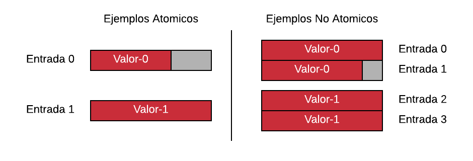
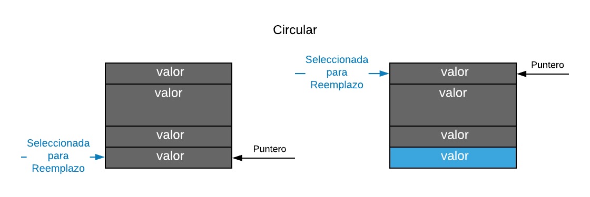
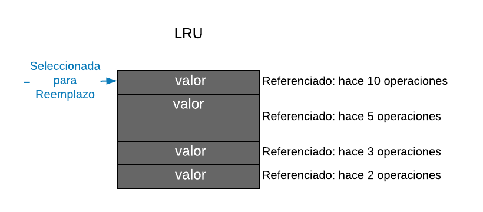
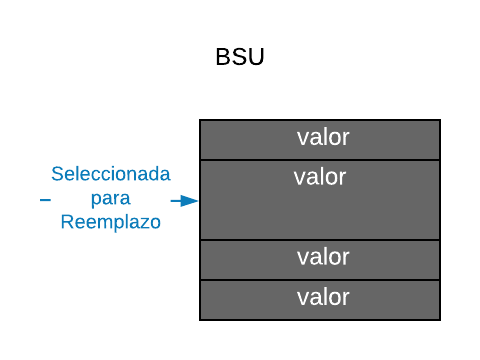

# Almacenamiento

El almacenamiento en cada Instancia está definido por una cantidad determinada de Entradas de tamaño configurable. En estas Entradas se almacenarán los datos, con la particularidad de que cada dato que se almacene será siempre en Entradas contiguas para facilitar el acceso.

## Dump

Cada determinado intervalo (por archivo de configuración) la instancia almacenará las claves y sus valores en el punto de montaje. La forma de guardarlo será archivo de texto simple, cuyo nombre será el nombre de la clave, y su contenido el valor. Esta información deberá ser recuperada al momento de iniciar una instancia.

## Entrada

Las Entradas son espacio delimitados dentro del almacenamiento en los cuales se pueden almacenar datos. Estas Entradas tienen un tamaño fijo con el fin de facilitar la gestión del almacenamiento.

## Clave

Las claves se conformarán por cadenas de hasta 40 caracteres.

## Valor

El valor almacenado para cada key será de tamaño variable, dando lugar a la posibilidad de que un valor ocupe más de una sola entrada en la Instancia de Re Distinto. Otros casos posibles que surgen por la naturaleza variable del valor son aquellos casos en los que el valor tiene menor tamaño que una Entrada; en este caso, se produce fragmentación interna[^13] en esta Entrada.

## Valor Atómico

Son aquellos valores que no exceden el tamaño de una entrada de almacenamiento. El proceso de reemplazo de entradas solo se aplica a aquellos valores que cumplan con este criterio.

## Algoritmos de Reemplazo

Dado que nuestro sistema se enfoca en aspectos de disponibilidad y no tanto en aspectos de consistencia, siempre se permitirá el almacenamiento de un nuevo. Para lograr esto cuando no existe más espacio, es necesario reemplazar entradas ya cargadas en la Instancia. El valor previo se perderá, y si un ESI intenta acceder a este, se abortará por Clave no encontrada.

### Circular

El algoritmo Circular consiste en tener un puntero sobre las entradas de almacenamiento de la Instancia, el cual establece qué entrada debe ser reemplazada. Una vez que se ha reemplazado la entrada, el puntero se mueve a la siguiente iterando hasta llegar al final. En cuanto llega a la última entrada, el puntero retorna a la primer posición. Así como en Distribución _Equitative Load_ es el algoritmo desempatador, en Reemplazo el algoritmo Circular será el desempatador.

### Least Recently Used

El algoritmo LRU se basa en llevar registro de hace cuánto fue referenciada cada entrada. Llegado el momento de reemplazar una entrada, se selecciona aquella entrada que ha sido referenciada hace mayor tiempo[^14].

### Biggest Space Used

Por último, el algoritmo BSU lleva registro de la cantidad de entradas que ocupa cada valor, y en el momento de un reemplazo, escoge aquél que ocupa más entradas.

## Compactación

Dada la naturaleza del almacenamiento en Re Distinto, existe la posibilidad de que se produzca fragmentación externa[^15], impidiendo almacenar más datos en casos en los que en realidad sí existe espacio para guardarlos. Ante éstas situaciones, Re Distinto activará automáticamente el proceso de Compactación ante dicho caso (el cual también puede ser ejecutado de forma manual con una operación). Este proceso se ejecuta internamente en cada una de las Instancias de forma simultánea; es decir, que cuando llegue el momento de realizar una Compactación, todas las Instancias realizarán dicho proceso.

El proceso de Compactación consiste en el reordenamiento de los datos almacenados en las Entradas, de forma de eliminar los huecos de espacio libre que se generan debido a la fragmentación externa.

Además de realizar el reordenamiento físico de los datos, es de suma importancia actualizar la información asociada de todas las estructuras administrativas de la Instancia, de manera de que éstas sean consistentes con la actualización del almacenamiento.

Mientras está en ejecución el proceso de Compactación y Dump, no se permitirá ejecutar operaciones en el Sistema de Re Distinto y quedarán en espera a que el proceso se complete correctamente.

---
[^13] Se profundizará en la cursada.
[^14] Para simplificar el manejo de referencias sólo se llevará cuenta de hace cuantas operaciones fue referenciada cada entrada, almacenando el número de ultima referencia y reemplazando el menor.
[^15] Se profundizará en la cursada.
