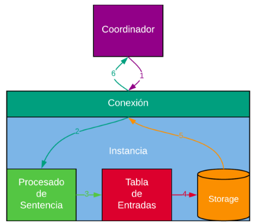

# Instancia

Las Instancias de Re Distinto son los procesos encargados del almacenamiento de los datos. Cada Instancia secciona su espacio de almacenamiento en lo que se denominan Entradas y al iniciar la conexión con el coordinador, se definirá el tamaño de las mismas así como la cantidad total disponible dentro de la Instancia. En la sección de almacenamiento se entrará más en detalle respecto a las Entradas.(^9)

## Tabla de Entradas

La Tabla de Entradas es una estructura administrativa de la Instancia de Re Distinto que permite gestionar el almacenamiento y facilitar el acceso a los valores almacenados.
Para esto, en cada elemento de la tabla se almacenará una clave, el número de entrada asociada y el tamaño del valor almacenado.(^9)

## Interacción con Coordinador

1. El Coordinador envía una sentencia de Re Distinto a la Instancia.
2. La Instancia procesa la sentencia con el fin de ejecutar la operación correctamente.
3. Al procesar la sentencia, obtiene la clave asociada que le permitirá acceder a la Tabla de Entradas.
4. De la Tabla de Entradas, se obtendrá la información necesaria para obtener el valor en el almacenamiento.
5. Se accede al valor y se prepara una respuesta para el Coordinador.
6. La Instancia envía el resultado al Coordinador.

## Configuración

| Campo                              | Tipo               | Ejemplo                     |
|------------------------------------|--------------------|-----------------------------|
| IP de Conexión al Coordinador      | [cadena]           | `"127.0.0.1"`               |
| Puerto de Conexión al Coordinador  | [numérico]         | `8000`                      |
| Algoritmo de Reemplazo             | CIRC / LRU / BSU   | `BSU`                       |
| Punto de montaje                   | [path absoluto]    | `"/home/utnso/instancia1/"` |
| Nombre de la Instancia             | [cadena]           | `"Instancia1"`              |
| Intervalo de dump (en segundos)    | [numérico]         | `10`                        |

---
^9: Para más información, investigar sobre el comando [malloc()](https://linux.die.net/man/3/malloc).

^10: Dada la naturaleza de almacenamiento contiguo de los valores, en caso de que el tamaño del valor exceda el tamaño de la entrada, éste continuará en la siguiente entrada.
